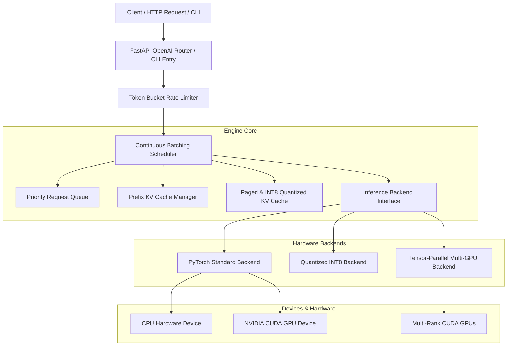

# ⚡ MicroGen: Modular, Hardware-Aware LLM Inference Engine

[](https://www.python.org/downloads/)
[](https://pytorch.org/)
[](https://fastapi.tiangolo.com/)
[]()
[](LICENSE)

**MicroGen** is a high-performance, modular, hardware-aware Large Language Model (LLM) inference engine built from scratch in PyTorch. Designed for low latency, high throughput, and memory efficiency across CPU and multi-GPU architectures, MicroGen implements state-of-the-art serving techniques including **Continuous Batching**, **Paged KV Cache**, **Prefix Caching**, **INT8 Weight & Dynamic KV Quantization**, **Multi-GPU Tensor Parallelism**, and **Speculative Decoding**.

---

## 📌 Short Description (For GitHub Repository)

> **MicroGen**: A modular PyTorch LLM inference engine and research testbed featuring Continuous Batching, Paged & Quantized INT8 KV Cache, Multi-GPU Tensor Parallelism, Speculative Decoding, and OpenAI-compatible SSE streaming API.

**Topics/Tags for GitHub:** `llm-inference`, `pytorch`, `kv-cache`, `continuous-batching`, `paged-attention`, `tensor-parallelism`, `quantization`, `speculative-decoding`, `fastapi`, `cuda`.

> **Note on Measurement Scope & Serving Layer**: Beyond the empirical benchmarking substrate described in the paper, MicroGen includes a working OpenAI-compatible HTTP serving layer (`microgen/api/` with FastAPI, SSE streaming, and 73 passing unit/integration tests) for practical use. The paper's $N=30$ throughput/latency figures reflect direct in-process engine-level measurement (isolating model, memory, and kernel dynamics), whereas end-to-end HTTP socket and ASGI network-layer load testing represents an ongoing research extension.

---

## 🌟 Key Features

- **🚀 Continuous Batching Scheduler**: Dynamic request admission, left-padded prefill, and decode iteration loops without static batching pauses or VRAM fragmentation.
- **🧠 Paged & Quantized INT8 KV Cache**:
  - **Paged KV Allocator**: Fixed-size physical memory block allocation with logical-to-physical sequence block mapping.
  - **Sliding Window Eviction**: Configurable window length eviction to serve long-context sequences.
  - **Grouped-Query Attention (GQA)**: Native `repeat_kv` key-value head repetition support.
  - **Dynamic INT8 KV Quantization**: Vector scale dynamic quantization delivering **>2x memory footprint reduction** with **>0.98 cosine logit similarity**.
- **⚡ Weight Quantization Engine**: Static per-channel INT8 weight quantization (`QuantizedLinear` wrapper) reducing model VRAM memory footprint.
- **🌐 Multi-GPU Tensor Parallelism**: Sharded model execution using `ColumnParallelLinear` and `RowParallelLinear` with all-reduce sum aggregation across GPU ranks.
- **🔮 Speculative Decoding Acceleration**: Target model logit verification, probability rejection sampling, and non-blocking KV cache state rollback on token rejection.
- **⚡ Prompt Prefix Caching & Rate Limiting**: SHA256 token sequence hashing with sub-sequence prefix lookup and thread-safe token-bucket rate limiting (RPM/TPM).
- **📊 Granular Profiler & Bottleneck Diagnostics**: Hardware CUDA/CPU event execution profiler and automated bottleneck classification (`prefill`, `decode`, `sampling`, `balanced`).
- **🔌 OpenAI-Compatible HTTP API**: Built with FastAPI, offering `/v1/chat/completions`, `/v1/completions`, and server-sent event (SSE) streaming.
- **🛠️ Unified CLI & Kaggle Benchmark Suite**: CLI runner (`microgen serve`, `generate`, `profile`) and automated Kaggle Multi-GPU benchmark runner producing visual HTML performance reports (`microgen_benchmark_report.html`).

---

## 🏗️ Architecture Overview



---

## 🛠️ Installation & Setup

### Prerequisites
- Python **3.11+**
- PyTorch **2.0+** (with CUDA support for GPU execution)

### 1. Clone Repository & Create Virtual Environment
```bash
git clone https://github.com/your-username/microgen.git
cd microgen

python -m venv venv
source venv/bin/activate  # On Linux/macOS
# or: venv\Scripts\activate on Windows
```

### 2. Install Dependencies
```bash
pip install -r requirements.txt
```

---

## 🚀 Quickstart & Usage Examples

### 1. Basic Generation via Python API
```python
from microgen.devices import get_device
from microgen.backends import PyTorchBackend

# 1. Initialize Hardware Device & Backend
device = get_device("cuda" if torch.cuda.is_available() else "cpu")
backend = PyTorchBackend(device=device)
backend.load_model("sshleifer/tiny-gpt2")

# 2. Tokenize & Prefill Prompt
tokenizer = backend._tokenizer
input_ids = tokenizer("MicroGen is a fast LLM engine", return_tensors="pt").input_ids
logits, cache = backend.prefill(input_ids)

# 3. Decode Loop
sampled_token = backend.sample(logits)
decode_logits, updated_cache = backend.decode(sampled_token, cache=cache)
```

### 2. INT8 Quantized Model Execution
```python
from microgen.backends import QuantizedPyTorchBackend
from microgen.runtime import KVCacheState

# INT8 Weight Quantization + Dynamic INT8 KV Cache
backend = QuantizedPyTorchBackend(device=device)
backend.load_model("sshleifer/tiny-gpt2")

cache = KVCacheState(quantize_kv=True)  # >2x VRAM Memory Compression
logits, updated_cache = backend.prefill(input_ids, cache=cache)
```

### 3. Multi-GPU Tensor Parallel Execution
```python
from microgen.backends import TensorParallelPyTorchBackend
from microgen.devices import get_device

# Partition Linear layers across 2 GPU ranks
devices = [get_device("cuda:0"), get_device("cuda:1")]
tp_backend = TensorParallelPyTorchBackend(world_size=2, devices=devices)
tp_backend.load_model("sshleifer/tiny-gpt2")

logits, cache = tp_backend.prefill(input_ids)
```

### 4. Running OpenAI-Compatible HTTP Server & SSE Streaming
Start the HTTP API server:
```bash
python -m microgen.cli.main serve --host 0.0.0.0 --port 8000 --model sshleifer/tiny-gpt2
```

Test non-streaming completion with `curl`:
```bash
curl -X POST http://localhost:8000/v1/chat/completions \
  -H "Content-Type: application/json" \
  -d '{
    "model": "sshleifer/tiny-gpt2",
    "messages": [{"role": "user", "content": "Explain LLM inference"}],
    "max_tokens": 50,
    "temperature": 0.7
  }'
```

Test SSE streaming completion:
```bash
curl -X POST http://localhost:8000/v1/chat/completions \
  -H "Content-Type: application/json" \
  -d '{
    "model": "sshleifer/tiny-gpt2",
    "messages": [{"role": "user", "content": "Write a poem"}],
    "stream": true
  }'
```

---

## 💻 Command Line Interface (CLI)

MicroGen includes a unified Click CLI:

```bash
# 1. Start Server
microgen serve --port 8000 --model sshleifer/tiny-gpt2

# 2. Text Generation via CLI
microgen generate --prompt "Artificial Intelligence is" --max-tokens 32

# 3. Profile Execution Bottlenecks
microgen profile --prompt "Benchmark continuous batching" --backend quantized
```

---

## 📊 Benchmarking & Kaggle GPU Runner

MicroGen includes an automated benchmarking suite and a standalone Kaggle runner that executes performance tests across backends and generates interactive HTML reports:

```bash
# Run End-to-End Latency & Throughput Benchmark
python scripts/e2e_benchmark.py

# Run Kaggle Automated Multi-GPU Benchmark Suite
python scripts/kaggle_benchmark_runner.py
```

**Artifacts Produced:**
- `kaggle_benchmark_results.json`: Detailed TTFT (ms), ITL (ms), Throughput (tok/s), and Memory metrics.
- `microgen_benchmark_report.html`: Self-contained visual HTML dashboard comparing all backends.

---

## 🧪 Testing & Verification

MicroGen is covered by a comprehensive unit and integration test suite:

```bash
# Run full test suite (73 passing tests)
PYTHONPATH=. pytest

# Run specific test modules
PYTHONPATH=. pytest tests/runtime/test_kv_cache.py
PYTHONPATH=. pytest tests/backends/test_parallel.py
```

---

## 📁 Repository Structure

```
microgen/
├── microgen/
│   ├── api/             # FastAPI HTTP app & SSE streaming endpoints
│   ├── backends/        # PyTorch, Quantized INT8, and TensorParallel backends
│   ├── caching/         # Prefix KV Cache & Token-Bucket Rate Limiter
│   ├── cli/             # Unified Click CLI commands
│   ├── devices/         # Hardware device abstractions (CPU & CUDA)
│   ├── profiling/       # Execution Profiler & Diagnostic Engine
│   ├── runtime/         # KVCacheState, Paged KV Allocator & Sliding Window Eviction
│   └── scheduler/       # Priority RequestQueue, Batching & Continuous Batching Scheduler
├── tests/               # 73 Unit & Integration Pytest suites
├── scripts/             # End-to-End Benchmarking & Kaggle Runner scripts
├── PROJECT_PLAN.md      # Persistent project roadmap log
├── ARCHITECTURE.md     # Architectural boundary rules
├── AGENTS.md           # Engineering guidelines
└── requirements.txt     # Python dependencies
```

---

## 📜 License

This project is licensed under the MIT License — see the [LICENSE](LICENSE) file for details.
