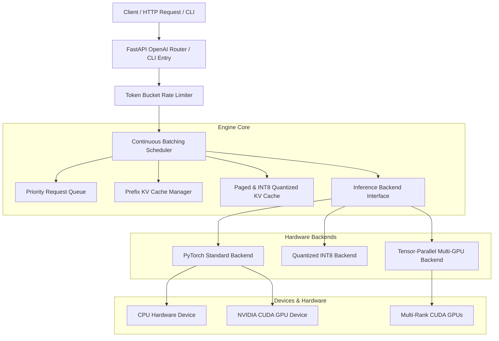

# ⚡ MicroGen: LLM Inference Optimization Research Framework

[](https://pypi.org/project/microgen-llm/)
[](https://www.python.org/downloads/)
[](https://pytorch.org/)
[](https://fastapi.tiangolo.com/)
[]()
[](LICENSE)

**MicroGen** (`microgen-llm` on PyPI) is a modular, hardware-aware Large Language Model (LLM) inference research framework and experimental substrate built from scratch in PyTorch. Designed to dissect memory, latency, and throughput trade-offs under controlled hardware and workload conditions, MicroGen isolates state-of-the-art serving techniques including **Physical Paged KV Allocation**, **Hash-Based Prefix Reuse**, **INT8 Weight Quantization**, **Multi-GPU Tensor Parallelism**, **Speculative Decoding**, and **Continuous Request Batching**.

---

## 📌 Research Framing & Evaluation Substrate

> **MicroGen**: An empirical LLM inference research substrate isolating optimization overheads, non-monotonic composition dynamics, and hardware trade-offs behind modular execution protocols. Tested via an $N=30$ repeated-trial evaluation protocol across NVIDIA Tesla T4 and P100 GPUs and open-weights model families (GPT-2, Qwen2.5, Llama-3.2).

**Topics/Tags for GitHub:** `llm-inference`, `systems-research`, `pytorch`, `kv-cache`, `continuous-batching`, `paged-attention`, `tensor-parallelism`, `quantization`, `speculative-decoding`, `fastapi`, `cuda`.

> **Note on Research Framework Positioning**: MicroGen is explicitly designed as an experimental systems research substrate for isolating optimization overheads and measuring non-monotonic interaction dynamics under controlled conditions, rather than competing directly with production C++/CUDA serving engines (e.g., vLLM, TensorRT-LLM, SGLang). Beyond the empirical benchmarking substrate described in the paper, MicroGen includes a working OpenAI-compatible HTTP serving layer (`microgen/api/` with FastAPI, SSE streaming, and 149 passing unit/integration tests). The paper's $N=30$ throughput/latency figures reflect direct in-process engine-level measurement (isolating model, memory, and kernel dynamics).

---

## 🌟 Key Empirical Discoveries & System Principles

- **🚀 Non-Monotonic Optimization Composition**: Combining individually useful optimizations (+INT8, +Paged KV, +Prefix Cache) yields a statistically significant throughput regression to **$0.96\times$ baseline** ($493.6 \pm 8.6\text{ tok/s}$, $p_{\text{adj}} < 0.001$), while continuous batching scheduler overhead drops throughput to **$0.76\times$ baseline** ($391.8 \pm 6.2\text{ tok/s}$, $p_{\text{adj}} < 0.001$) due to cumulative Python event loop and pointer indirection overheads ($\eta_{\text{overhead}} = 24.8\%$).
- **🧠 Physical Block Paged KV Allocation**: Dynamically assigns $B_{\text{block}}=16$ token physical blocks, eliminating external contiguous-allocation memory fragmentation ($F_{\text{ext}} = 1 - \frac{\text{max contiguous block}}{\text{total free VRAM}} = 0.0\%$) under dynamic memory pressure regimes.
- **⚡ Hash-Based Prefix Cache Reuse**: Implements exact longest-common-prefix (LCP) key lookup as an experimental baseline approximation of shared-prefix caching, delivering up to a **$3.91\times$ prefill TTFT speedup** ($6.6 \pm 0.3\text{ ms}$ vs $25.8 \pm 1.2\text{ ms}$, $p_{\text{adj}} < 0.001$) under 100% prompt overlap at $L_{\text{prompt}}=1024$ tokens, crossing into positive speedup once prompt overlap exceeds 25%.
- **🔮 Speculative Decoding Acceptance Boundaries**: Characterizes acceptance rate break-even threshold $\alpha_{\text{threshold}} = \frac{T_{\text{draft\_step}}}{T_{\text{target\_step}}}$. On small target models (`tiny-gpt2`), draft step overhead ($4.4\text{ ms}$) exceeds verification savings, resulting in a throughput regression (**$0.45\times$ baseline**, $p_{\text{adj}} < 0.001$).
- **🌐 Multi-GPU Tensor Parallelism**: Shards linear projections across dual NVIDIA T4 GPUs ($TP=2$), accelerating memory-bound decoding for GPT-2 ($124\text{M}$) from $8.2\text{ tok/s}$ to $14.0\text{ tok/s}$ (**$1.71\times$ speedup**, $p_{\text{adj}} < 0.001$).

### 🎯 Portfolio & Resume Framing (Research $\rightarrow$ Methodology $\rightarrow$ Discovery $\rightarrow$ Result)
- **LLM Inference Systems Architecture**: Designed and built **MicroGen**, a modular PyTorch LLM inference research framework isolating memory, latency, and throughput trade-offs across CPU, CUDA, and multi-GPU ($TP=2$) execution protocols.
- **Non-Monotonic Composition Analysis**: Discovered through an $N=30$ repeated-trial ablation protocol that composing individually positive optimizations (+INT8, +Paged KV, +Prefix Cache) yields non-monotonic throughput degradation (**$0.96\times$ baseline**, $p_{\text{adj}} < 0.001$).
- **Prefix Reuse & TTFT Acceleration**: Implemented an experimental hash-based longest-common-prefix (LCP) KV cache manager achieving a **$3.91\times$ prefill TTFT speedup** ($6.6\text{ ms}$ vs $25.8\text{ ms}$, $p_{\text{adj}} < 0.001$) under 100% prompt overlap.
- **Continuous Batching Overhead Profiling**: Built a micro-profiling harness isolating Python event loop overhead ($\eta_{\text{overhead}} = 24.8\%$), causally explaining continuous batching throughput regressions (**$0.76\times$ baseline**, $p_{\text{adj}} < 0.001$) in research substrates.
- **Memory Modeling & Multi-GPU Acceleration**: Formalized external VRAM allocation fragmentation ($F_{\text{ext}} = 1 - \frac{\text{max contiguous block}}{\text{total free VRAM}}$) and sharded linear projections across dual NVIDIA T4 GPUs ($TP=2$), delivering a **$1.71\times$ throughput speedup** ($14.0\text{ tok/s}$ vs $8.2\text{ tok/s}$, $p_{\text{adj}} < 0.001$).

---

## 🏗️ Architecture Overview


```mermaid
flowchart TD
    Client[Client / HTTP Request / CLI] --> API[FastAPI OpenAI Router / CLI Entry]
    API --> RateLimiter[Token Bucket Rate Limiter]
    RateLimiter --> Scheduler[Continuous Batching Scheduler]
    
    subgraph Engine Core
        Scheduler --> RequestQueue[Priority Request Queue]
        Scheduler --> PrefixCache[Prefix KV Cache Manager]
        Scheduler --> KVCache[Paged & INT8 Quantized KV Cache]
        Scheduler --> Backend[Inference Backend Interface]
    end

    subgraph Hardware Backends
        Backend --> PyTorchBackend[PyTorch Standard Backend]
        Backend --> QuantizedBackend[Quantized INT8 Backend]
        Backend --> TPBackend[Tensor-Parallel Multi-GPU Backend]
    end

    subgraph Devices & Hardware
        PyTorchBackend --> CPUDevice[CPU Hardware Device]
        PyTorchBackend --> CUDADevice[NVIDIA CUDA GPU Device]
        TPBackend --> MultiGPU[Multi-Rank CUDA GPUs]
    end
```

---

## 🛠️ Installation & Setup

### Install from PyPI
```bash
pip install microgen-llm
```

### Install from Source
```bash
git clone https://github.com/Omdeepb69/MicroGen.git
cd MicroGen

python -m venv venv
source venv/bin/activate  # On Linux/macOS
# or: venv\Scripts\activate on Windows

pip install -e .
```

---

## 🚀 Quickstart & Usage Examples

### 1. Fluent SDK Wrapper API (`microgen.LLMEngine`)
```python
import microgen

# Initialize engine with PyTorch FP32 backend
engine = microgen.LLMEngine.from_pretrained(
    "sshleifer/tiny-gpt2",
    backend_type="pytorch",
    device="cuda"
)

# Generate completion text
output = engine.generate("MicroGen is a fast LLM inference engine", max_tokens=32)
print("Output:", output)
```

### 2. INT8 Quantized Model Execution
```python
import microgen

# Load quantized backend (INT8 weights + dynamic INT8 KV cache)
engine = microgen.LLMEngine.from_pretrained(
    "sshleifer/tiny-gpt2",
    backend_type="quantized",
    device="cuda"
)

output = engine.generate("Quantized inference reduces VRAM footprint", max_tokens=32)
print("Quantized Output:", output)
```

### 3. Multi-GPU Tensor Parallel Execution ($TP=2$)
```python
import microgen

# Partition linear layers across 2 GPU ranks
tp_engine = microgen.LLMEngine.from_pretrained(
    "gpt2",
    backend_type="tensor_parallel",
    tp_world_size=2
)

output = tp_engine.generate("Distributed tensor parallelism scales decoding", max_tokens=32)
print("TP Output:", output)
```

### 4. OpenAI-Compatible HTTP Serving & SSE Streaming
Start the HTTP API server:
```bash
microgen serve --host 0.0.0.0 --port 8000 --model sshleifer/tiny-gpt2
```

Test completion with `curl`:
```bash
curl -X POST http://localhost:8000/v1/chat/completions \
  -H "Content-Type: application/json" \
  -d '{
    "model": "sshleifer/tiny-gpt2",
    "messages": [{"role": "user", "content": "Explain LLM inference"}],
    "max_tokens": 50,
    "temperature": 0.7
  }'
```

Test Server-Sent Events (SSE) streaming:
```bash
curl -X POST http://localhost:8000/v1/chat/completions \
  -H "Content-Type: application/json" \
  -d '{
    "model": "sshleifer/tiny-gpt2",
    "messages": [{"role": "user", "content": "Write a poem"}],
    "stream": true
  }'
```

---

## 💻 Command Line Interface (CLI)

MicroGen provides a rich Click-based unified CLI (`microgen`):

```bash
# 1. Start Server
microgen serve --port 8000 --model sshleifer/tiny-gpt2

# 2. Terminal Interactive Chat
microgen chat --model sshleifer/tiny-gpt2

# 3. Standalone Text Generation
microgen generate --prompt "Artificial Intelligence is" --max-tokens 32

# 4. Run Benchmark Suite
microgen benchmark --model sshleifer/tiny-gpt2

# 5. Profile Execution Bottlenecks
microgen profile --prompt "Benchmark continuous batching" --backend quantized
```

---

## 📊 Benchmarking & Reproducibility Package

MicroGen includes an automated statistical benchmarking suite ($N=30$ repeated trials):

```bash
# Run End-to-End Latency & Throughput Benchmark
python scripts/e2e_benchmark.py

# Export LaTeX Paper Tables (paper/tables/*.tex)
python scripts/export_paper_tables.py

# Generate Publication Vector Figures (paper/figures/*.pdf)
python scripts/generate_paper_figures.py
```

**Artifacts Produced:**
- `paper/main.pdf`: Compiled 14-page research manuscript.
- `arxiv_submission.zip`: Self-contained arXiv submission bundle.

---

## 🧪 Testing & Verification

MicroGen is covered by a comprehensive 149-test Pytest suite:

```bash
# Run full isolated test suite (149 passing tests)
PYTEST_DISABLE_PLUGIN_AUTOLOAD=1 python -m pytest
```

---

## 📁 Repository Structure

```
microgen/
├── microgen/
│   ├── api/             # FastAPI HTTP app & SSE streaming endpoints
│   ├── backends/        # PyTorch, Quantized INT8, and TensorParallel backends
│   ├── caching/         # Prefix KV Cache & Token-Bucket Rate Limiter
│   ├── cli/             # Unified Click CLI commands
│   ├── devices/         # Hardware device abstractions (CPU & CUDA)
│   ├── profiling/       # Execution Profiler & Diagnostic Engine
│   ├── runtime/         # KVCacheState, Paged KV Allocator & Sliding Window Eviction
│   ├── sdk/             # High-level LLMEngine wrapper API
│   └── scheduler/       # Priority RequestQueue, Batching & Continuous Batching Scheduler
├── paper/               # LaTeX research manuscript, tables, vector figures, and arXiv zip
├── tests/               # 149 Unit & Integration Pytest test cases
├── scripts/             # End-to-End Benchmarking & Table export scripts
├── pyproject.toml       # PyPI packaging specification (`microgen-llm`)
└── README.md            # Primary repository documentation
```

---

## 📜 License

This project is licensed under the MIT License — see the [LICENSE](LICENSE) file for details.
